# Sincronizar tu Fork

!!! warning "IMPORTANTE"
    Tu fork NO se actualiza automaticamente. Debes sincronizarlo manualmente para obtener los ejercicios nuevos que el profesor agregue.

---

## El Problema

Cuando haces fork, obtienes una **copia en ese momento**. Durante el curso agregare ejercicios nuevos, pero **tu fork NO se actualiza solo**.

```
SEMANA 1: Hiciste Fork
  Repo Profesor: [01] [02]
  Tu Fork:       [01] [02] ✅

SEMANA 3: Profesor agrego ejercicios
  Repo Profesor: [01] [02] [03] [04] [05]
  Tu Fork:       [01] [02] ❌ (te faltan 03, 04, 05)
```

---

## Solucion Facil (Recomendada para Principiantes)

### Desde GitHub Web

!!! tip "Metodo mas sencillo"
    Este es el metodo recomendado si no te sientes comodo con la terminal.

**Paso 1:** Ve a tu fork en GitHub

```
https://github.com/TU_USUARIO/ejercicios-bigdata
```

**Paso 2:** Buscar el banner de sincronizacion

Cuando hay cambios nuevos, veras un banner:

```
┌────────────────────────────────────────────────────┐
│  ⚠️ This branch is 15 commits behind                │
│     TodoEconometria:main                            │
│                                                     │
│     [Sync fork ▼]  ← CLICK AQUI                    │
└────────────────────────────────────────────────────┘
```

**Paso 3:** Click en "Sync fork" → "Update branch"

```
┌────────────────────────────────────────────────────┐
│  Sync fork                                          │
│  ┌────────────────────────────────────────────┐   │
│  │ This will update your branch with the      │   │
│  │ latest changes from TodoEconometria:main   │   │
│  │                                             │   │
│  │  [Update branch] ← CLICK AQUI              │   │
│  │  [Discard commits]                          │   │
│  └────────────────────────────────────────────┘   │
└────────────────────────────────────────────────────┘
```

**Paso 4:** Actualizar tu copia local

Ahora tu fork en GitHub esta actualizado, pero tu PC no. Ejecuta:

```bash
git checkout main
git pull origin main
```

**Paso 5:** Traer cambios a tu rama de trabajo

```bash
# Ve a tu rama de ejercicio
git checkout tu-apellido-ejercicio

# Trae los cambios de main
git merge main

# Sube a GitHub
git push origin tu-apellido-ejercicio
```

:white_check_mark: **Listo!** Tienes los ejercicios nuevos sin perder tu trabajo.

---

## Diagrama Visual del Flujo

### Como funciona la sincronizacion

```
┌─────────────────────────────────────────────────────────────────┐
│                    FLUJO DE SINCRONIZACION                      │
├─────────────────────────────────────────────────────────────────┤
│                                                                  │
│  INICIO - Estado actual                                         │
│  ━━━━━━━━━━━━━━━━━━━━━━━━━                                      │
│                                                                  │
│  📚 Repo Profesor (upstream)         🌐 Tu Fork (origin)        │
│  ┌──────────────────────┐            ┌──────────────────────┐  │
│  │ main:                │            │ main:                │  │
│  │ [01][02][03][04][05] │            │ [01][02]             │  │
│  │         ↑            │            │                      │  │
│  │    Tiene nuevos!     │            │  Desactualizado!     │  │
│  └──────────────────────┘            └──────────────────────┘  │
│                                                                  │
│  💻 Tu PC (local)                                               │
│  ┌──────────────────────────────────────────────────────────┐  │
│  │ main: [01][02]                                           │  │
│  │ garcia-ejercicio: [01][02] + TUS ARCHIVOS ✅             │  │
│  └──────────────────────────────────────────────────────────┘  │
│                                                                  │
│  ═══════════════════════════════════════════════════════════   │
│                                                                  │
│  PASO 1: git checkout main                                      │
│  ━━━━━━━━━━━━━━━━━━━━━━━━━━                                     │
│                                                                  │
│  💻 Tu PC - Te mueves a rama main                              │
│  ┌──────────────────────────────────────────────────────────┐  │
│  │ ✓ main: [01][02]                     ← Estas aqui        │  │
│  │   garcia-ejercicio: [01][02] + TUS ARCHIVOS              │  │
│  └──────────────────────────────────────────────────────────┘  │
│                                                                  │
│  ═══════════════════════════════════════════════════════════   │
│                                                                  │
│  PASO 2: git fetch upstream + git merge upstream/main           │
│  ━━━━━━━━━━━━━━━━━━━━━━━━━━━━━━━━━━━━━━━━━━━━━━━━━━━━━━━       │
│                                                                  │
│  📚 Repo Profesor ────────────────────────> 💻 Tu PC main      │
│  ┌──────────────────────┐                  ┌────────────────┐  │
│  │ [01][02][03][04][05] │ ─ Descarga ───>  │ [01][02]       │  │
│  └──────────────────────┘    [03][04][05]  │ [03][04][05] ✨│  │
│                                             └────────────────┘  │
│                                                                  │
│  💻 Tu PC despues del merge                                     │
│  ┌──────────────────────────────────────────────────────────┐  │
│  │ ✓ main: [01][02][03][04][05]         ← Actualizado! ✅   │  │
│  │   garcia-ejercicio: [01][02] + TUS ARCHIVOS              │  │
│  └──────────────────────────────────────────────────────────┘  │
│                                                                  │
│  ═══════════════════════════════════════════════════════════   │
│                                                                  │
│  PASO 3: git checkout garcia-ejercicio                          │
│  ━━━━━━━━━━━━━━━━━━━━━━━━━━━━━━━━━━━━                          │
│                                                                  │
│  💻 Tu PC - Te mueves a tu rama de trabajo                     │
│  ┌──────────────────────────────────────────────────────────┐  │
│  │   main: [01][02][03][04][05]                             │  │
│  │ ✓ garcia-ejercicio: [01][02] + TUS ARCHIVOS ← Estas aqui │  │
│  └──────────────────────────────────────────────────────────┘  │
│                                                                  │
│  ═══════════════════════════════════════════════════════════   │
│                                                                  │
│  PASO 4: git merge main                                         │
│  ━━━━━━━━━━━━━━━━━━━━━━                                         │
│                                                                  │
│  💻 Combina main con tu rama de trabajo                        │
│                                                                  │
│  main: [01][02][03][04][05]                                     │
│            │                                                     │
│            │ merge (combinar)                                   │
│            ↓                                                     │
│  garcia-ejercicio: [01][02] + TUS ARCHIVOS                      │
│                    [03][04][05] ✨                              │
│                                                                  │
│  💻 Tu PC despues del merge                                     │
│  ┌──────────────────────────────────────────────────────────┐  │
│  │   main: [01][02][03][04][05]                             │  │
│  │ ✓ garcia-ejercicio: [01-05] + TUS ARCHIVOS ✅            │  │
│  │                      ↑                                    │  │
│  │           Tienes todo: ejercicios nuevos + tu trabajo!   │  │
│  └──────────────────────────────────────────────────────────┘  │
│                                                                  │
│  ═══════════════════════════════════════════════════════════   │
│                                                                  │
│  PASO 5: git push origin garcia-ejercicio                       │
│  ━━━━━━━━━━━━━━━━━━━━━━━━━━━━━━━━━━━━━                         │
│                                                                  │
│  💻 Tu PC ──────────────────────────────> 🌐 Tu Fork           │
│  ┌─────────────────────────┐             ┌──────────────────┐  │
│  │ garcia-ejercicio:       │   Subir     │ garcia-ejercicio:│  │
│  │ [01-05] + TUS ARCHIVOS  │ ─────────>  │ [01-05] + TUS   │  │
│  └─────────────────────────┘             │     ARCHIVOS ✅  │  │
│                                           └──────────────────┘  │
│                                                                  │
│  ✅ RESULTADO FINAL                                             │
│  ━━━━━━━━━━━━━━━━━━                                             │
│                                                                  │
│  ✓ Tienes los ejercicios nuevos [03][04][05]                   │
│  ✓ Tu trabajo esta intacto                                     │
│  ✓ Todo subido a GitHub                                        │
│  ✓ Listo para crear Pull Request                               │
│                                                                  │
└─────────────────────────────────────────────────────────────────┘
```

---

## Diagrama Interactivo (Mermaid)

```mermaid
graph TD
    A[👨‍🏫 Repo Profesor<br/>upstream/main<br/>01 02 03 04 05]
    B[🌐 Tu Fork GitHub<br/>origin/main<br/>01 02]
    C[💻 Tu PC - main<br/>01 02]
    D[💻 Tu PC - garcia-ejercicio<br/>01 02 + TUS ARCHIVOS]

    C2[💻 Tu PC - main<br/>01 02 03 04 05 ✅]
    D2[💻 Tu PC - garcia-ejercicio<br/>01-05 + TUS ARCHIVOS ✅]
    B2[🌐 Tu Fork GitHub<br/>garcia-ejercicio<br/>01-05 + TUS ARCHIVOS ✅]

    A -->|PASO 2: fetch + merge| C2
    C2 -->|PASO 4: merge| D2
    D2 -->|PASO 5: push| B2

    style A fill:#e1f5ff,stroke:#0277bd,stroke-width:3px
    style C2 fill:#e8f5e9,stroke:#388e3c,stroke-width:3px
    style D2 fill:#f3e5f5,stroke:#7b1fa2,stroke-width:3px
    style B2 fill:#fff9c4,stroke:#f57f17,stroke-width:3px
```



---

## Metodo Detallado (Terminal)

### Situacion

Trabajas en una rama (ejemplo: `garcia-ejercicio-1.1`) y el profesor agrego ejercicios nuevos.

**Objetivo:** Traer los ejercicios nuevos SIN perder tu trabajo.

### PASO 1: Guarda tu trabajo actual

```bash
# Ver que archivos cambiaste
git status

# Guardar tus cambios
git add entregas/1.1_sqlite/tu_apellido_nombre/
git commit -m "Guardar mi avance"
```

### PASO 2: Ve a tu rama main

```bash
git checkout main
```

### PASO 3: Descarga los cambios del profesor

```bash
git fetch upstream
git merge upstream/main
```

Ahora tu `main` local tiene los ejercicios nuevos :white_check_mark:

### PASO 4: Vuelve a tu rama de trabajo

```bash
git checkout garcia-ejercicio-1.1
```

(Reemplaza `garcia-ejercicio-1.1` por el nombre de TU rama)

### PASO 5: Trae los ejercicios nuevos a tu rama

```bash
git merge main
```

!!! info "Que hace esto?"
    Combina los ejercicios nuevos del profesor con tu trabajo. **NO borra nada tuyo.**

### PASO 6: Sube a GitHub

```bash
git push origin garcia-ejercicio-1.1
```

:white_check_mark: **Listo!** Tienes los ejercicios nuevos Y tu trabajo intacto.

---

## Que Pasa Cuando el Profesor Agrega Ejercicios?

```
┌─────────────────────────────────────────────────────────────┐
│        QUE PASA CUANDO EL PROFESOR AGREGA EJERCICIOS?      │
├─────────────────────────────────────────────────────────────┤
│                                                              │
│  SEMANA 1 - Hiciste tu Fork                                 │
│  ┌────────────────────────────┐                             │
│  │ Repo Profesor               │                             │
│  │ ├── ejercicio_01/           │                             │
│  │ └── ejercicio_02/           │                             │
│  └────────────────────────────┘                             │
│              │ Fork                                          │
│              ↓                                               │
│  ┌────────────────────────────┐                             │
│  │ Tu Fork                     │                             │
│  │ ├── ejercicio_01/           │                             │
│  │ └── ejercicio_02/           │ ✅ Sincronizados            │
│  └────────────────────────────┘                             │
│                                                              │
│  ═══════════════════════════════════════════════════════    │
│                                                              │
│  SEMANA 3 - Profesor agrego ejercicios 03, 04, 05          │
│  ┌────────────────────────────┐                             │
│  │ Repo Profesor               │                             │
│  │ ├── ejercicio_01/           │                             │
│  │ ├── ejercicio_02/           │                             │
│  │ ├── ejercicio_03/ ← NUEVO   │                             │
│  │ ├── ejercicio_04/ ← NUEVO   │                             │
│  │ └── ejercicio_05/ ← NUEVO   │                             │
│  └────────────────────────────┘                             │
│                                                              │
│  ┌────────────────────────────┐                             │
│  │ Tu Fork                     │                             │
│  │ ├── ejercicio_01/           │                             │
│  │ └── ejercicio_02/           │ ❌ Desactualizado!          │
│  │                             │    (te faltan 03, 04, 05)   │
│  └────────────────────────────┘                             │
│                                                              │
│  ⚠️ Tu fork NO se actualiza solo, debes sincronizarlo!      │
│                                                              │
└─────────────────────────────────────────────────────────────┘
```

---

## Regla de Oro para Evitar Problemas

!!! success "Trabaja SOLO en la carpeta `entregas/`"

    ```
    ✅ BIEN - Edita solo aqui:
    entregas/1.1_sqlite/tu_apellido_nombre/
    ├── ANALISIS_DATOS.md
    ├── resumen_eda.md
    └── REFLEXION.md

    ❌ MAL - NO toques esto:
    ejercicios/01_bases_de_datos/1.1_introduccion_sqlite/
    ├── README.md              ← NO TOCAR
    ├── eda_exploratorio.py    ← Solo ejecutar, NO modificar
    ```

**Si solo editas archivos en `entregas/TU_CARPETA/`, NUNCA tendras conflictos.**

---

## Que hago si Git dice "CONFLICT"?

### Paso 1: Git te dira que archivo tiene conflicto

```bash
Auto-merging ejercicio_01.py
CONFLICT (content): Merge conflict in ejercicio_01.py
Automatic merge failed; fix conflicts and then commit the result.
```

### Paso 2: Abre el archivo

Veras algo asi:

```python
<<<<<<< HEAD
tu codigo aqui
=======
codigo del profesor
>>>>>>> main
```

### Paso 3: Decide que mantener

- Si es un archivo del profesor que NO deberias tocar → Mantén la version del profesor
- Si es TU archivo de entrega → Mantén tu version

### Paso 4: Borra las marcas

Elimina estas lineas:

```
<<<<<<< HEAD
=======
>>>>>>> main
```

### Paso 5: Termina el merge

```bash
git add nombre-del-archivo
git commit -m "Resolver conflicto"
git push origin tu-rama
```

!!! tip "Consejo"
    Si trabajas solo en `entregas/TU_CARPETA/`, esto nunca te pasara.

---

## Resumen Ultra-Rapido

```bash
# 1. Guardar tu trabajo
git add .
git commit -m "Guardar avance"

# 2. Actualizar main
git checkout main
git fetch upstream
git merge upstream/main

# 3. Volver a tu rama y traer cambios
git checkout tu-rama
git merge main

# 4. Subir
git push origin tu-rama
```

**Frecuencia:** Haz esto cada lunes antes de clase.

---

## Buenas Practicas de Sincronizacion

### 1. Sincroniza ANTES de empezar un ejercicio nuevo

```bash
# ✅ BIEN - Sincronizar primero
git fetch upstream && git merge upstream/main
# Ahora empieza a trabajar

# ❌ MAL - Trabajar con codigo viejo
# Empiezas sin actualizar, luego tienes conflictos
```

### 2. Haz un commit de tu trabajo ANTES de sincronizar

```bash
# ✅ BIEN - Guarda tu trabajo primero
git add .
git commit -m "Avance en ejercicio 03"
git fetch upstream && git merge upstream/main

# ❌ MAL - Sincronizar con cambios sin guardar
# Puedes perder tu trabajo
```

### 3. Frecuencia recomendada

```
┌────────────────────────────────────────┐
│  📅 CALENDARIO DE SINCRONIZACION       │
├────────────────────────────────────────┤
│                                         │
│  Lunes: Sincronizar antes de clase     │
│  └─ git fetch upstream                 │
│     git merge upstream/main            │
│                                         │
│  Durante la semana:                    │
│  └─ Trabajar normalmente en ejercicios │
│                                         │
│  Viernes: Push de tu avance            │
│  └─ git push origin main               │
│                                         │
│  Domingo (opcional):                   │
│  └─ Verificar si hay actualizaciones   │
│                                         │
└────────────────────────────────────────┘
```

---

## Verificar Estado de Sincronizacion

### Comando util para saber si estas desactualizado

```bash
# Ver diferencias entre tu fork y el repo del profesor
git fetch upstream
git log HEAD..upstream/main --oneline
```

**Si ves commits nuevos:**

```
a1b2c3d Agregar ejercicio 06
d4e5f6g Corregir typo en ejercicio 05
g7h8i9j Agregar datos para ejercicio 06
```

Significa que tienes 3 commits (ejercicios/actualizaciones) que no tienes.

**Si no ves nada:**

```
(vacio)
```

Significa que estas actualizado. :white_check_mark:

---

## Proximos Pasos

Ahora que sabes como sincronizar tu fork:

- [Crear Pull Requests](pull-requests.md) - Entregar tus ejercicios
- [Comandos Utiles](comandos-utiles.md) - Cheatsheet de Git
- [Fork y Clone](fork-clone.md) - Si necesitas repasar los conceptos basicos
