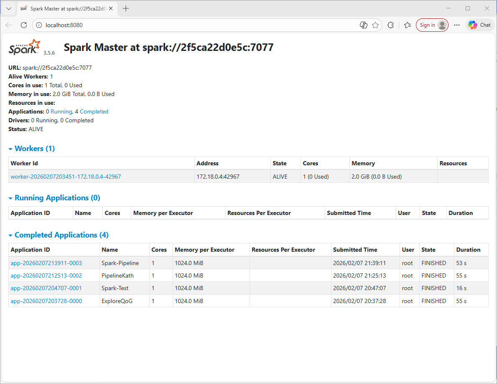

# Paso 2: Infraestructura Docker

**Alumno:** Katherine Almache Riofrio 

---

## 2.1 Mi docker-compose.yml explicado

Explica **cada seccion** de tu archivo YAML con tus propias palabras.
No copies definiciones de internet; demuestra que entiendes lo que escribiste.

### Servicio: PostgreSQL

```yaml
postgres:
  image: postgres:15-alpine
  container_name: postgres
  environment:
    POSTGRES_USER: bigdata
    POSTGRES_PASSWORD: bigdata
    POSTGRES_DB: proyecto
  ports:
    - "5432:5432"
  volumes:
    - pg_data:/var/lib/postgresql/data
  healthcheck:
    test: [ "CMD-SHELL", "pg_isready -U bigdata -d proyecto" ]
    interval: 10s
    timeout: 5s
    retries: 5
  restart: unless-stopped

```

**Que hace:** 
- Este servicio levanta una base de datos PostgreSQL para guardar datos del proyecto de forma persistente (por ejemplo tablas con datos limpios, agregados o resultados del EDA).
 image: postgres:15-alpine: uso una versión ligera (alpine) para que consuma menos recursos en mi ordenador.
- container_name: postgres: le pongo un nombre fijo para identificarlo fácil en Docker Desktop y comandos.
- environment: define credenciales y la base de datos inicial:
- POSTGRES_USER, POSTGRES_PASSWORD: usuario/contraseña de acceso.
- POSTGRES_DB: crea la base de datos llamada proyecto al arrancar.
- ports: "5432:5432": abre el puerto de Postgres para que mi PC pueda conectarse (por ejemplo desde Python, DBeaver, o PgAdmin si lo añado).
- volumes: pg_data:/var/lib/postgresql/data guarda físicamente los datos de Postgres en un volumen. Así si paro o recreo el contenedor, la base de datos no se borra.
- healthcheck: comprueba si Postgres está listo con pg_isready. Esto evita problemas de “arranca pero aún no acepta conexiones”.
- restart: unless-stopped: si el contenedor se cae, Docker lo reinicia automáticamente (a menos que yo lo pare manualmente).
### Servicio: Spark Master

```yaml
spark-master:
  image: public.ecr.aws/bitnami/spark:3.5
  container_name: spark-master
  environment:
    - SPARK_MODE=master
  ports:
    - "8080:8080"   # Spark UI
    - "7077:7077"   # Spark master (cluster)
  volumes:
    - ./data:/opt/bitnami/spark/data
    - ./scripts:/opt/bitnami/spark/scripts
  restart: unless-stopped

```

**Que hace:**
- Este servicio levanta el Spark Master, que es el “coordinador” del cluster:
  - no procesa los datos pesados en sí,
  - se encarga de organizar los trabajos y repartir tareas a los workers.
- SPARK_MODE=master: le digo a la imagen que arranque como master.
- Puertos:
  - 8080: es la Spark UI del Master, donde se ve el cluster, los workers conectados, memoria, trabajos, etc.
  - 7077: es el puerto del master para que los workers y los jobs se conecten al cluster (URL tipo spark://spark-master:7077).
- volumes:
  - ./data:/opt/bitnami/spark/data: carpeta local con datasets compartida dentro del contenedor, así Spark puede leer archivos.
  - ./scripts:/opt/bitnami/spark/scripts: carpeta con scripts PySpark (jobs) para ejecutarlos desde el contenedor si lo necesito.
- restart: unless-stopped: reinicio automático en caso de fallo.
### Servicio: Spark Worker

```yaml
spark-worker-1:
  image: public.ecr.aws/bitnami/spark:3.5
  container_name: spark-worker-1
  environment:
    - SPARK_MODE=worker
    - SPARK_MASTER_URL=spark://spark-master:7077
    - SPARK_WORKER_MEMORY=2G
    - SPARK_WORKER_CORES=1
  depends_on:
    - spark-master
  volumes:
    - ./data:/opt/bitnami/spark/data
  restart: unless-stopped
```

**Que hace:** 
- Este servicio levanta un worker de Spark, que es quien ejecuta el trabajo real (transformaciones, cálculos, lecturas/escrituras).
- SPARK_MASTER_URL=spark://spark-master:7077:
  - aquí el worker se conecta al master usando el nombre del servicio spark-master (DNS interno de Docker).
- depends_on: spark-master:
  - asegura que primero arranque el master (aunque esto no garantiza “listo”, solo “arrancado”).
- Recursos que asigné por mi ordenador:
  - SPARK_WORKER_CORES=1: el worker usa 1 core.
  - SPARK_WORKER_MEMORY=2G: limita memoria a 2GB para evitar que mi PC se quede sin recursos.
- volumes: ./data...:
  - comparte datos con el worker para que pueda leer los mismos archivos del proyecto.

### Otros servicios (si los tienes)

 - N/A
---
## 2.2 Healthchecks

## 2.2 Healthchecks en Docker
Los healthchecks son comprobaciones automáticas que Docker ejecuta para verificar si un servicio está realmente listo (no solo "encendido", sino operando correctamente).
- **Caso de uso: PostgreSQL**
    - PostgreSQL puede tardar unos segundos en iniciar, inicializar la base de datos y quedar disponible para conexiones externas.
    - El healthcheck utiliza la herramienta `pg_isready` para confirmar que:
        - El usuario existe.
        - La base de datos `proyecto` está accesible.
        - Postgres ya acepta conexiones.


**Que pasa si PostgreSQL no tiene healthcheck y Spark intenta conectarse
antes de que este listo?]**
- Puede fallar la conexión (errores tipo `connection refused` o `database system is starting up`).
    - Eso puede romper un **pipeline automático** (por ejemplo, un script que escriba a Postgres al arrancar).
    - Con **healthcheck** (y si añado `depends_on: condition: service_healthy` en servicios dependientes) se reduce mucho ese riesgo.
- En esta infraestructura, **Spark** no conecta automáticamente a Postgres "al arrancar", pero el healthcheck sigue siendo **buena práctica** porque:
    - Evita problemas cuando lanzo scripts rápidamente.
    - Facilita la integración de nuevos servicios que sí dependan de la DB.
---

## 2.3 Evidencia: Captura Spark UI

[Inserta aqui tu captura de pantalla del Spark UI mostrando el Worker conectado]



**Que se ve en la captura:**
En la captura se muestra la interfaz web del **Spark Master**, accesible desde [http://localhost:8080](http://localhost:8080).

- **Estado del Master:**
    - Spark Master activo, con versión **Spark 3.5.6**.
    - La URL del cluster es `spark://7e53274b22c1:7077`, que corresponde al endpoint que utilizan los workers y las aplicaciones para conectarse.
    - El estado del cluster aparece como **ALIVE**, lo que indica que el master funciona correctamente.

- **Apartado Workers (1):**
    - 1 worker conectado y activo.
    - **Identificador:** `worker-20260207183417-172.18.0.4-35901`.
    - **Dirección interna:** `172.18.0.4:35901` (red interna de Docker).
    - **Recursos asignados:**
        - 1 core disponible (0 usados).
        - 2.0 GiB de memoria total (configurado en `docker-compose.yml`).

- **Ejecución de Aplicaciones:**
    - En **Running Applications** y **Completed Applications** no hay tareas registradas.
    - Esto indica que el cluster está levantado y a la espera de recibir *jobs*.

- **Conclusión de la captura:**
    - El cluster Spark funciona correctamente.
    - El Master reconoce al worker.
    - Los recursos de Docker se reflejan fielmente en la **Spark UI**.

---
## 2.4 Prompts utilizados para la infraestructura

**OBLIGATORIO:** Pega aqui los prompts EXACTOS que usaste para construir tu
docker-compose.yml. Si no usaste IA, ve a la seccion 2.5.

> **Por que pedimos esto?** No evaluamos si usaste IA o no. Evaluamos si
> ENTIENDES lo que generaste. Un buen prompt demuestra que sabes lo que
> necesitas. Un prompt generico ("hazme un docker-compose") demuestra que no.

### Prompt 1 (el primero que usaste):

**Herramienta:** [ChatGPT]

**Tu prompt exacto:**
```
Necesito:
- Pasos para montar un mini laboratio big data en local en mi disco Duro SSD externo para no saturar mi ordenador que no tiene mucha capacidad. Evita que el disco C: se llene al guardar datos y resultados en un SSD externo mediante un Directory Junction en Windows.
- Deber generar El archivo docker-compose.yml, tengo que usar los siguientes servicios: Apache Spark formado un cluster que contenga 1 aspark master, spark worker y postgres para almacenar los datos.  
- Explícame también para qué sirve cada servicio con ejemplos claros y reales con los que pueda entender cómo funciona lo que estoy haciendo.
```

**Que te devolvio (resumen en 2-3 lineas):**

Me devolvio los pasos a ejecutar: preparación del entorno SSD, pasos para crear el Directory Junction y después de dió la configuración de Servicios, es decir, docker-compose.yml
Luego me dió la definición d cada servicio, describiendo qué es Apache Spark con un ejemplo.
**Que tuviste que cambiar de esa respuesta y por que:**

[Que partes NO funcionaron o tuviste que adaptar]
Al intentar ejecutar otra vez el docker-compose.yml usando docker compose up -d lo que hace es hacer que el contenedor empeize a correr.
Si lo hago desde otra carpeta usando el mismo docker-compose.yml obtengo un error en el que me dice que ya existe otro contenedor con el mismo nombre
```
  Error response from daemon: Conflict. The container name "/spark-master" is already in use by container "7e53274b22c13193b89b8d2255aff41a6f49d64a0001c12327de0d0e4b3611f4". You have to remove (or rename) that container to be able to reuse that name. 0.2s
 - Container postgres             Creating                                                                         0.2s
Error response from daemon: Conflict. The container name "/spark-master" is already in use by container "7e53274b22c13193b89b8d2255aff41a6f49d64a0001c12327de0d0e4b3611f4". You have to remove (or rename) that container to be able to reuse that name.

```
Si les cambio el nombre funciona perfectamente y tiene sentido ya que los contenedores deben tener nombre único
```
 0.2docker compose up -d
time="2026-02-07T20:09:04+01:00" level=warning msg="E:\\docker-ejemplo\\docker-compose.yml: the attribute `version` is obsolete, it will be ignored, please remove it to avoid potential confusion"renam
[+] up 3/3ntainer to be able to reuse that name.
 ✔ Container spark-master-kath Created                                                         0.7s
 ✔ Container postgres-kath     Created                                                         0.7s
 ✔ Container spark-worker-kath Created                                                         0.2s

```
---

### Prompt 2 (si iteraste o pediste correccion):

**Herramienta:** [ChatGPT / Claude / Copilot / otra]

**Tu prompt exacto:**
```
[PEGA AQUI]
```

**Que te devolvio y que cambiaste:**

[Tu respuesta]

---

### Prompt 3 (si necesitaste mas iteraciones):

[Repite el formato. Agrega tantos como hayas necesitado.]

---

## 2.5 Recursos web consultados (si NO usaste IA)

Si en lugar de IA consultaste documentacion, tutoriales o videos:

| Recurso | URL | Que aprendiste de el |
|---------|-----|---------------------|
| | | |
| | | |
| | | |

## 2.6 Recursos
---

### Información de Referencia y Autoría
*   **Autor original / Referencia:** [@TodoEconometria](https://github.com)
*   **Profesor:** Juan Marcelo Gutierrez Miranda
*   **Metodología:** Cursos Avanzados de Big Data, Ciencia de Datos, Desarrollo de aplicaciones con IA & Econometria Aplicada.
*   **Hash ID de Certificación:** `4e8d9b1a5f6e7c3d2b1a0f9e8d7c6b5a4f3e2d1c0b9a8f7e6d5c4b3a2f1e0d9c`
*   **Repositorio oficial:** [TodoEconometria/certificaciones](https://github.com/certificaciones)

---

### Referencia Académica
1.  **Zaharia, M., et al. (2016).** *Apache Spark: A unified engine for big data processing.* Communications of the ACM, 59(11), 56-65.
2.  **Teorey, T., et al. (2011).** *Quality of Government Standard Dataset.* University of Gothenburg.
3.  **Merkel, D. (2014).** *Docker: Lightweight Linux Containers for Consistent Development and Deployment.* Linux Journal, 2014(239), 2.

### Recursos y Documentación del Proyecto
- **Material teórico del curso:** `ejercicios/07_infraestructura_bigdata/` (Docker, Spark, Hadoop)
- **Documentación de Spark:** [Apache Spark 3.5.4](https://spark.apache.org/docs/3.5.4/)
- **Documentación de Docker:** [Docker Compose Guide](https://docs.docker.com/compose/)
- **QoG Codebook:** [Quality of Government Data](https://www.gu.se/en/quality-government/qog-data)
    - *Nota: Descargar el codebook para la interpretación de variables.*
- **Monitoreo del Cluster:** [Spark UI](http://localhost:8080) (Accesible en `http://localhost:8080` una vez levantado el entorno).
