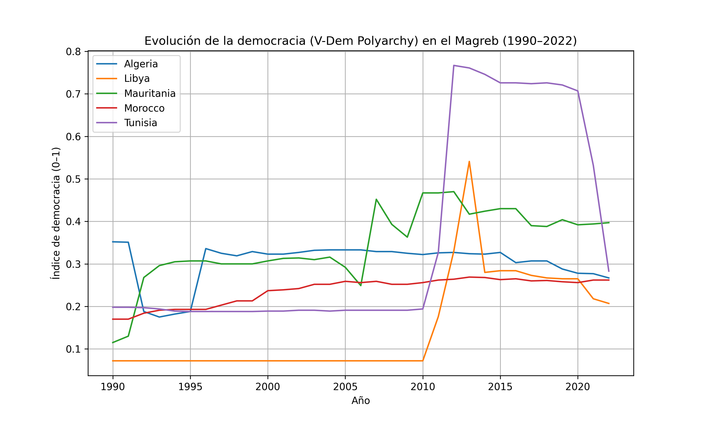
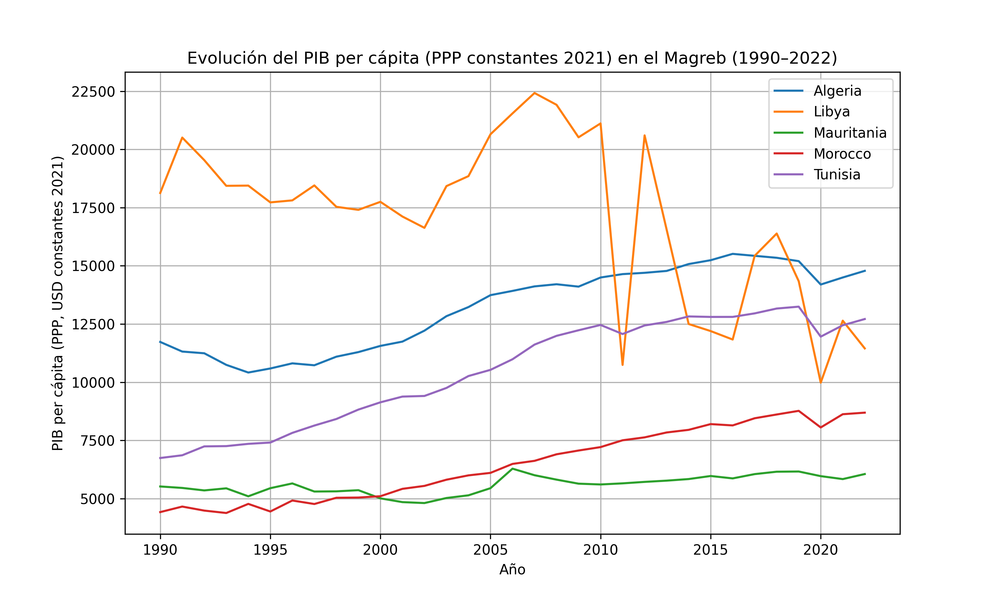

# Paso 4: Resultados y Analisis

**Alumno:** Katherine Almache 
**Pregunta de investigacion:** 
 - Contexto: Desarrollo político–económico en el Magreb: autoritarismo vs democracia
 - ¿Cómo ha evolucionado el nivel de democracia y desarrollo económico en los países del Magreb entre 1990 y 2022?
   - Marruecos 
   - Argelia 
   - Túnez 
   - Egipto 
   - Libia
---

## 3.1 Grafico 1: Análisis de Trayectorias Democráticas en el Magreb



### Interpretacion de Análisis de Trayectorias Democráticas en el Magreb

El gráfico muestra trayectorias claramente **divergentes** en el nivel de democracia entre los países del Magreb:

- **Túnez:** Destaca como el caso más significativo, con un fuerte incremento del índice democrático a partir de **2011** (coincidiendo con la *Primavera Árabe*), seguido de un retroceso gradual en los años posteriores.
- **Marruecos:** Presenta una evolución **lenta pero estable**, con mejoras moderadas a lo largo del período analizado.
- **Argelia:** Mantiene niveles relativamente bajos y constantes, con ligeras caídas registradas recientemente.
- **Libia:** Muestra una mejora abrupta tras 2011 seguida de una **fuerte volatilidad**, lo que refleja la inestabilidad institucional posterior al colapso del régimen de Gadafi.
- **Mauritania:** Presenta oscilaciones constantes, pero sin una consolidación democrática clara.

**Conclusión del análisis:**
En conjunto, el gráfico evidencia que los procesos de democratización en el Magreb han sido **desiguales** y altamente dependientes de eventos políticos específicos, más que de una evolución gradual y sostenida.


[Escribe un parrafo respondiendo estas preguntas:
- Que patron o tendencia se observa en el grafico?
- Hay diferencias entre los paises? Cuales?
- Hay algun punto de inflexion o cambio notable? En que anio?
- Como se relaciona esto con tu pregunta de investigacion?]

### Prompt que usaste para generar este grafico

**Herramienta:** [ChatGPT]

**Tu prompt exacto:**
```
Genera un gráfico de líneas en Python con matplotlib que muestre la evolución temporal
del índice vdem_polyarchy para varios países, usando un DataFrame de pandas
con columnas country, year y vdem_polyarchy.

```
**Que tuviste que ajustar:**
[Que cambiaste de lo que te genero la IA para que funcionara o se viera bien]

---

## 3.2 Grafico 2: Análisis de Evolución Económica (PIB per cápita) en el Magreb

)

### Interpretacion de Análisis de Evolución Económica (PIB per cápita) en el Magreb

El segundo gráfico muestra una evolución económica **heterogénea** entre los países de la región:

- **Libia:** Presenta niveles elevados de PIB per cápita, pero con una **volatilidad extrema** a partir de 2011. Esto refleja el impacto directo del conflicto armado y una alta dependencia de los ingresos petroleros.
- **Argelia:** Muestra un **crecimiento sostenido** a largo plazo, caracterizado por fluctuaciones moderadas.
- **Marruecos y Mauritania:** Presentan trayectorias más estables, aunque con niveles de ingreso per cápita significativamente inferiores al resto de la región.
- **Túnez:** Evidencia una mejora económica progresiva hasta mediados de la década de 2010, seguida de un periodo de **estancamiento** y ligeros retrocesos recientes.

**Conclusión del análisis:**
Estos resultados sugieren que un mayor nivel de ingreso **no garantiza** estabilidad política ni consolidación democrática, especialmente en economías altamente dependientes de recursos naturales (rentismo).


### Prompt que usaste para generar este grafico

**Herramienta:** [ChatGPT]

**Tu prompt exacto:**
```
Genera un gráfico de líneas en matplotlib que muestre la evolución del PIB per cápita
por país a lo largo del tiempo usando pandas.

```

**Que tuviste que ajustar:**
[Tu respuesta]

---

## 3.3 Respuesta a mi pregunta de investigacion

## 3. Conclusiones: Interacción entre Economía y Democracia

El análisis comparativo de los datos permite extraer las siguientes conclusiones fundamentales sobre la región del Magreb:

*   **Ausencia de Correlación Directa:** Los datos muestran que la evolución de la democracia en el Magreb **no sigue un patrón homogéneo** ni está directamente correlacionada con el nivel de desarrollo económico.
*   **La Excepción Tunecina:** Túnez representa una **excepción temporal**, con una mejora democrática significativa tras el año 2011, aunque dicha tendencia no se ha logrado sostener de forma sólida en el largo plazo.
*   **Estabilidad vs. Democratización:** Países como **Argelia y Marruecos** muestran una estabilidad política relativa manteniendo niveles bajos de democratización, independientemente de sus fluctuaciones en el PIB.
*   **El Fenómeno de la Renta Petrolera (Libia):** El caso de Libia evidencia que un elevado PIB per cápita (basado en rentas petroleras) **no se traduce en instituciones sólidas**. Por el contrario, la dependencia de recursos naturales en contextos de colapso estatal genera una volatilidad extrema.

**Balance Final:**
En conjunto, el análisis sugiere que los **factores políticos e institucionales** tienen un peso significativamente mayor que el desempeño económico en los procesos de democratización del Magreb.


---

## 3.4 Limitaciones

Es fundamental señalar ciertas limitaciones metodológicas que condicionan el alcance de las conclusiones obtenidas:

*   **Alcance Geográfico y de Variables:** El análisis se restringe a un grupo de cinco países y a un número acotado de variables. Esta muestra limitada impide la generalización de los resultados a otras regiones o contextos geopolíticos distintos.
*   **Volatilidad por Conflictos:** Algunos países presentan una **alta volatilidad** en sus series de datos debido a conflictos armados internos. Esta inestabilidad dificulta una comparación temporal lineal y puede generar sesgos en la interpretación de las tendencias de largo plazo.
*   **Agregación de Datos Económicos:** El uso del **PIB per cápita** como indicador principal es una medida agregada que no permite capturar:
    *   Las desigualdades internas en la distribución de la renta.
    *   La calidad del crecimiento económico.
    *   El impacto del desarrollo humano real en la población.

---
# 3.5 Información de Referencia y Autoría

### Datos del Proyecto
*   **Autor del trabajo:** Katherine Almache 
*   **Profesor:** Juan Marcelo Gutierrez Miranda
*   **Asignatura / Metodología:** Cursos Avanzados de Big Data, Ciencia de Datos, Desarrollo de Aplicaciones con IA & Econometría Aplicada.
*   **Contexto académico:** Análisis y visualización de datos socioeconómicos y políticos mediante pipelines Big Data con Apache Spark.
*   **Tecnologías empleadas:** `Apache Spark`, `Docker`, `Docker Compose`, `Python`, `Pandas`, `Matplotlib`.
*   **Dataset principal:** Quality of Government (QoG) Standard Dataset – Time Series.
*   **Hash ID de Certificación:** 
    `4e8d9b1a5f6e7c3d2b1a0f9e8d7c6b5a4f3e2d1c0b9a8f7e6d5c4b3a2f1e0d9c`
*   **Repositorio del proyecto:** [Enlace a tu repositorio de GitHub aquí]

---

### Referencias Académicas

1.  **Zaharia, M., et al. (2016).** *Apache Spark: A unified engine for big data processing.* Communications of the ACM, 59(11), 56–65.
    > Referencia fundamental para el uso de Spark como motor de procesamiento distribuido en el pipeline ETL.
2.  **Teorey, T., Dahlberg, S., Holmberg, S., Rothstein, B., Alvarado Pachon, N. (2023).** *Quality of Government Standard Dataset.* University of Gothenburg.
    > Fuente principal de los indicadores de democracia, desarrollo económico y calidad institucional utilizados en el análisis.
3.  **Merkel, D. (2014).** *Docker: Lightweight Linux Containers for Consistent Development and Deployment.* Linux Journal, 2014(239).
    > Base conceptual para la arquitectura basada en contenedores utilizada en el proyecto.
4.  **Coppedge, M., et al. (2020).** *V-Dem Methodology v10.* Varieties of Democracy Institute.
    > Referencia metodológica para la interpretación del índice `V-Dem Polyarchy` empleado en el análisis democrático.

---

### Recursos y Documentación del Proyecto

*   **Material teórico del curso:** `ejercicios/07_infraestructura_bigdata/` (Docker, Spark, Hadoop, arquitectura Big Data).
*   **Documentación oficial de Apache Spark:** [Spark 3.5.4 Documentation](https://spark.apache.org/docs/3.5.4/)
*   **Documentación oficial de Docker Compose:** [Docker Compose Guide](https://docs.docker.com/compose/)
*   **QoG Codebook (imprescindible):** [Quality of Government Data](https://www.gu.se/en/quality-government/qog-data)
    *   *Nota: El codebook ha sido utilizado para la correcta interpretación de los indicadores `vdem_polyarchy` y `wdi_gdpcappppcon2021`.*
*   **Monitoreo del cluster Spark:** [Spark UI – http://localhost:8080](http://localhost:8080)
    *   *Accesible una vez levantado el entorno Docker con el servicio Spark Master activo.*


